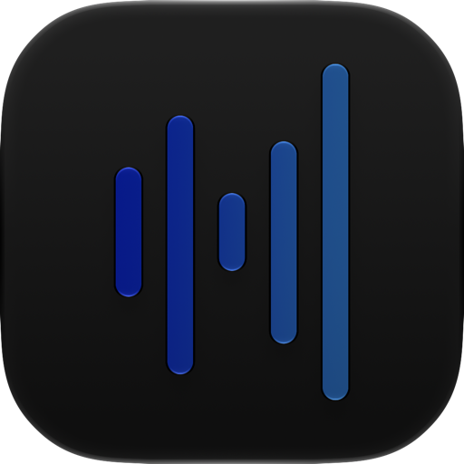

  

<h1 align="center">Glassify</h1>

Spotify, in glass. Free and open source.

  
  
  
  

  <a href="#build-it">Build it</a> ·
  <a href="#whats-different-from-spotipw">What's different</a> ·
  <a href="docs/tweaks.md">Hack on it</a> ·
  <a href="#license-and-credits">License</a>

  
  
  
  
  
  

> **Glassify is a free, open source fork of [spoti.pw](https://github.com/skopevoj/spoti.pw).**
> spoti.pw has since moved to a paid model (chroma.pw), and its newer releases are no longer open
> source: from 0.22.0 they are under the PolyForm Strict license. Glassify continues from the last
> GPL-3.0 version of spoti.pw (upstream commit
> [`c790445`](https://github.com/skopevoj/spoti.pw/tree/c790445)) and stays GPL-3.0, so anyone can
> use it, change it and share it. It contains none of spoti.pw's post-license-change code.

A no-jailbreak Theos tweak that rebuilds Spotify for iOS in Liquid Glass, injected into your own
decrypted IPA and signed with your own certificate.

Built and tested on **Spotify 9.1.78** — use that version's IPA. The tweak hooks Spotify's own classes,
which change between releases, so another version may build and then break.

| | |
|---|---|
| The redesign | **iOS 26+** |
| Legacy look | iOS 16.1+ |
| Live Activity | iOS 17+ |

The redesign is `UIGlassEffect`, which only exists from iOS 26. Below that the Redesigned UI switch is
greyed out and Glassify runs Spotify's own screens with everything else it adds on top. Everything is
in **Settings → Glassify**, the first row of Spotify's own settings.

## What's different from spoti.pw

Glassify is spoti.pw's GPL-3.0 code, with:

**Added**

- **Live cover**: the album's animated cover from Apple Music, or the track's Canvas, plays at the top
  of the player, with the background colours following it and a crossfade as you swipe the player down.
  Choose and order the sources on the Now playing page; Apple Music comes first by default.
- **Animated lock screen artwork** from the same sources, in an order of its own on the Lock screen
  widget page, with the next
  track's clip fetched ahead so it starts as the song does.
- **Artist logos** from Apple Music in place of the name on artist pages, where one exists.
- **Spicy Lyrics** as a lyrics source: the community's word-by-word syncs, then Apple Music's and
  Spotify's. Bring your own free publishable key from
  [developers.spicylyrics.org](https://developers.spicylyrics.org/) (allow requests without an origin)
  and paste it under Glassify → Player → Lyrics. Its credit, which Spicy Lyrics' terms require, always
  shows under the lyrics in the redesign.
- **App icon** choice: Glassify's own icon or Spotify's, under Glassify → Appearance.
- Richer page colours taken from the artwork, closer to Apple Music's, and artist pages that keep the
  photo's colour all the way down with the photo left sharp.
- A black fade behind the Home and Library headers, so content scrolling under the title fades out
  instead of showing through it, and more room between Home's title and its tiles.
- Fixes: the player's footer row when a song was shared by a friend ("From …"), a doubled tab bar and a
  missing selected tab while swiping the player down.

**Removed**

- The update checker and the usage report it sent to spoti.pw's server, the donation prompts, and the
  links to spoti.pw's site, Discord and GitHub.

spoti.pw's own animated lock screen artwork arrived after its license change and is not part of
Glassify. The lock screen artwork, live cover and artist logos here were written independently, without
reference to that code.

## Build it

No IPA is distributed. Bring a decrypted **Spotify 9.1.78** IPA; you get an unsigned IPA to sign with
SideStore, Feather or any certificate signer.

### Build on a Mac

Theos in `~/theos` and Xcode with an iPhoneOS 26+ SDK (`xcode-select` it). An SDK in `~/theos/sdks`
alone builds too, but without the Live Activity. Then:

    brew install make ldid dpkg zsign ideviceinstaller libimobiledevice
    uv tool install "cyan @ git+https://github.com/asdfzxcvbn/pyzule-rw"

Put the decrypted `.ipa` in `ipa/`, then:

    make release    # out/spoti.pw-<version>.ipa, ready to sign
    make install    # the same, signed with your certificate and pushed over USB

`make install` reads `SIGN_P12`, `SIGN_PROFILE` and `SIGN_P12_PASSWORD` from `.signing.env`; copy
`.signing.env.example` and fill it in. The first build spends a minute reading Spotify's flags out of
your IPA. `make flags` regenerates it.

To install Glassify **next to** the real Spotify, with its own name, icon and the Spotify icon as the
alternate, give it a bundle id of your own:

    BUNDLE_ID=com.you.glassify ALT_ICON_DIR=<folder with SpotifyIcon60x60@2x.png and @3x.png> \
      make install DEV_NAME=Glassify DEV_ICON=docs/glassify-icon.png

### Build with GitHub Actions

Fork the repo, enable Actions, run **Build IPA from your own Spotify IPA**. It takes a direct link to
your decrypted `.ipa` and hands the built IPA back as a workflow artifact. No Mac needed; the link is
masked in the log and the result stays in your fork.

### Signing

Sign with a bundle id matching your certificate's App ID. If it doesn't match, the app still works but
tapping the player on the lock screen won't open it — and it tells you on first launch which id to use.
With a wildcard App ID, `make install` signs the app and each extension under its own id. In Feather,
copy the App ID into **Identifier** and leave **PPQ protection** off; AltStore, SideStore and
Sideloadly get this right on their own.

## License and credits

Glassify is licensed under the [GNU General Public License v3.0](LICENSE), the license spoti.pw was
released under up to and including the version it is forked from. If you share a build, share its
source too, under the same license.

Glassify is a fork of **[spoti.pw](https://github.com/skopevoj/spoti.pw) by Vojtěch Škopek**, which did
the hard work: the redesign, the hooks and the tooling all come from it. Changes since the fork point
are Glassify's and are listed above; the git history has the rest.

[cyan](https://github.com/asdfzxcvbn/pyzule-rw) injects, [Theos](https://theos.dev) builds, and
[FLEX](https://github.com/FLEXTool/FLEX), as hopeless's AutoFLEX build in `vendor/`, is the inspector
the view trees are read through. The lyrics hook follows
[EeveeSpotify Reincarnated](https://github.com/SideloadLabs/EeveeSpotifyReincarnated)'s. Lyrics come
from the sources you choose, each credited where its terms ask.

Not affiliated with Spotify, spoti.pw or chroma.pw.
